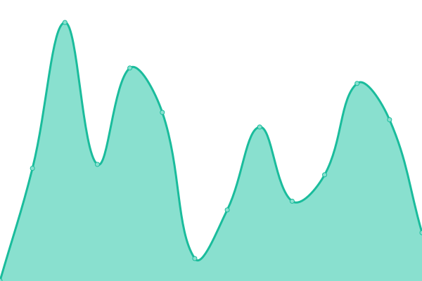
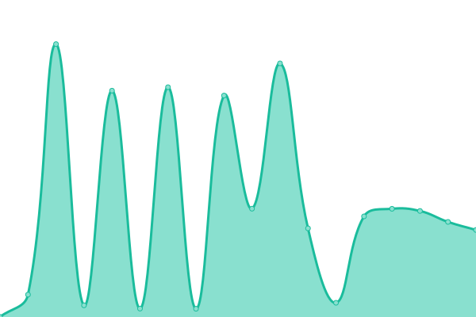
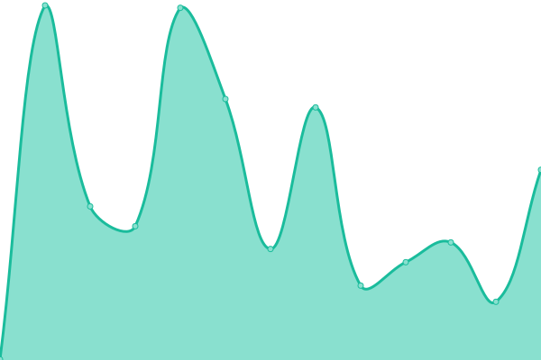
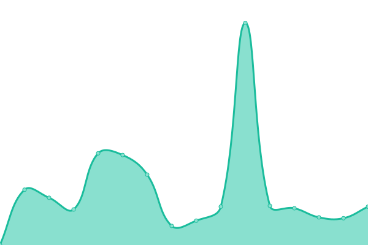
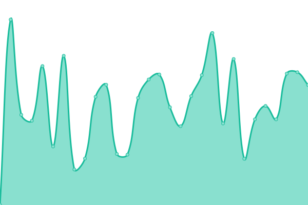
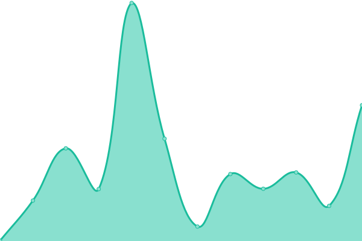
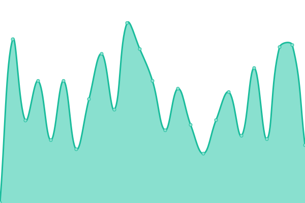
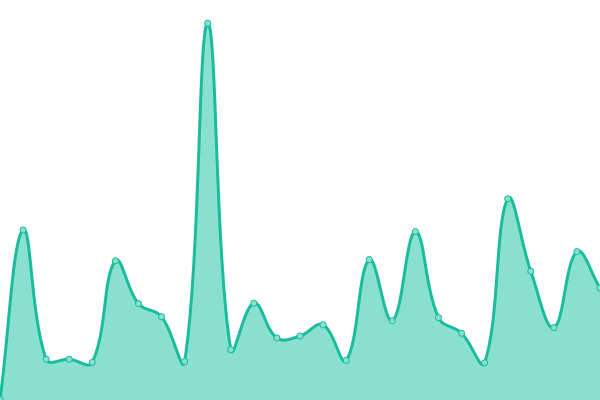
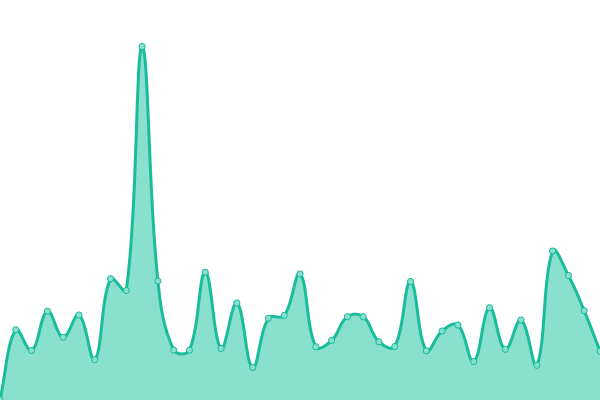

# [📈 Live Status](https://uptime.mjtwebsites.com): <!--live status--> **🟥 Complete outage**

This repository contains the open-source uptime monitor and status page for [MJTSoftware](https://uptime.mjtwebsites.com), powered by [Upptime](https://github.com/upptime/upptime).

With [Upptime](https://upptime.js.org), you can get your own unlimited and free uptime monitor and status page, powered entirely by a GitHub repository. We use [Issues](https://github.com/MJTSoftware/MJT-Uptime/issues) as incident reports, [Actions](https://github.com/MJTSoftware/MJT-Uptime/actions) as uptime monitors, and [Pages](https://uptime.mjtwebsites.com) for the status page.

<!--start: status pages-->
<!-- This summary is generated by Upptime (https://github.com/upptime/upptime) -->
<!-- Do not edit this manually, your changes will be overwritten -->
<!-- prettier-ignore -->
| URL | Status | History | Response Time | Uptime |
| --- | ------ | ------- | ------------- | ------ |
|  [MJT Websites](https://mjtwebsites.com/) | 🟥 Down | [mjt-websites.yml](https://github.com/MJTSoftware/MJT-Uptime/commits/HEAD/history/mjt-websites.yml) | 

 233ms
     
 | 

<a href="https://uptime.mjtwebsites.com/history/mjt-websites">97.11%</a>
    

|  [Apex Waste](https://apexwaste.net/) | 🟥 Down | [apex-waste.yml](https://github.com/MJTSoftware/MJT-Uptime/commits/HEAD/history/apex-waste.yml) | 

 223ms
     
 | 

<a href="https://uptime.mjtwebsites.com/history/apex-waste">97.11%</a>
    

|  [Appendix Cancer Connection](https://appendix-cancer.org/) | 🟥 Down | [appendix-cancer-connection.yml](https://github.com/MJTSoftware/MJT-Uptime/commits/HEAD/history/appendix-cancer-connection.yml) | 

 901ms
     
 | 

<a href="https://uptime.mjtwebsites.com/history/appendix-cancer-connection">97.11%</a>
    

|  [Appleseed Childhood Education](https://appleseed.gives/) | 🟥 Down | [appleseed-childhood-education.yml](https://github.com/MJTSoftware/MJT-Uptime/commits/HEAD/history/appleseed-childhood-education.yml) | 

 455ms
     
 | 

<a href="https://uptime.mjtwebsites.com/history/appleseed-childhood-education">97.11%</a>
    

|  [BCC](https://www.bcclegal.com/) | 🟥 Down | [bcc.yml](https://github.com/MJTSoftware/MJT-Uptime/commits/HEAD/history/bcc.yml) | 

 212ms
     
 | 

<a href="https://uptime.mjtwebsites.com/history/bcc">97.11%</a>
    

|  [CBC Surgery](https://www.cbcsurgery.com/) | 🟥 Down | [cbc-surgery.yml](https://github.com/MJTSoftware/MJT-Uptime/commits/HEAD/history/cbc-surgery.yml) | 

 226ms
     
 | 

<a href="https://uptime.mjtwebsites.com/history/cbc-surgery">97.11%</a>
    

|  [Clarks Cutting Edge](https://clarkscuttingedge.com/) | 🟥 Down | [clarks-cutting-edge.yml](https://github.com/MJTSoftware/MJT-Uptime/commits/HEAD/history/clarks-cutting-edge.yml) | 

 2499ms
     
 | 

<a href="https://uptime.mjtwebsites.com/history/clarks-cutting-edge">97.10%</a>
    

|  [Cornerstone Community Church](https://www.cccofkouts.com/) | 🟥 Down | [cornerstone-community-church.yml](https://github.com/MJTSoftware/MJT-Uptime/commits/HEAD/history/cornerstone-community-church.yml) | 

 813ms
     
 | 

<a href="https://uptime.mjtwebsites.com/history/cornerstone-community-church">97.10%</a>
    

|  [Countryside Landscaping](https://www.countrysidelandscapingservices.com/) | 🟥 Down | [countryside-landscaping.yml](https://github.com/MJTSoftware/MJT-Uptime/commits/HEAD/history/countryside-landscaping.yml) | 

 252ms
     
 | 

<a href="https://uptime.mjtwebsites.com/history/countryside-landscaping">97.10%</a>
    

|  [Craig Anderson Plumbing](https://www.craigandersonplumbing.com/) | 🟥 Down | [craig-anderson-plumbing.yml](https://github.com/MJTSoftware/MJT-Uptime/commits/HEAD/history/craig-anderson-plumbing.yml) | 

 255ms
     
 | 

<a href="https://uptime.mjtwebsites.com/history/craig-anderson-plumbing">97.10%</a>
    

|  [DeMotte Decorative Stone](https://demottedecorativestone.com/) | 🟥 Down | [de-motte-decorative-stone.yml](https://github.com/MJTSoftware/MJT-Uptime/commits/HEAD/history/de-motte-decorative-stone.yml) | 

 270ms
     
 | 

<a href="https://uptime.mjtwebsites.com/history/de-motte-decorative-stone">97.10%</a>
    

|  [DeMotte Glass](https://www.demotteglass.com/) | 🟥 Down | [de-motte-glass.yml](https://github.com/MJTSoftware/MJT-Uptime/commits/HEAD/history/de-motte-glass.yml) | 

 242ms
     
 | 

<a href="https://uptime.mjtwebsites.com/history/de-motte-glass">97.10%</a>
    

|  [F&M Transfer](https://www.fmtransfer.net/) | 🟥 Down | [f-and-m-transfer.yml](https://github.com/MJTSoftware/MJT-Uptime/commits/HEAD/history/f-and-m-transfer.yml) | 

 252ms
     
 | 

<a href="https://uptime.mjtwebsites.com/history/f-and-m-transfer">97.10%</a>
    

|  [First Brew Coffee Co](https://firstbrew.coffee/) | 🟥 Down | [first-brew-coffee-co.yml](https://github.com/MJTSoftware/MJT-Uptime/commits/HEAD/history/first-brew-coffee-co.yml) | 

 432ms
     
 | 

<a href="https://uptime.mjtwebsites.com/history/first-brew-coffee-co">97.10%</a>
    

|  [First Church](https://first.church/) | 🟥 Down | [first-church.yml](https://github.com/MJTSoftware/MJT-Uptime/commits/HEAD/history/first-church.yml) | 

 323ms
     
 | 

<a href="https://uptime.mjtwebsites.com/history/first-church">97.10%</a>
    

|  [Friends of TheWC](https://friendsofthewc.org/) | 🟥 Down | [friends-of-the-wc.yml](https://github.com/MJTSoftware/MJT-Uptime/commits/HEAD/history/friends-of-the-wc.yml) | 

 254ms
     
 | 

<a href="https://uptime.mjtwebsites.com/history/friends-of-the-wc">97.10%</a>
    

|  [Hamstra Gardens](https://hamstragardens.com/) | 🟥 Down | [hamstra-gardens.yml](https://github.com/MJTSoftware/MJT-Uptime/commits/HEAD/history/hamstra-gardens.yml) | 

 238ms
     
 | 

<a href="https://uptime.mjtwebsites.com/history/hamstra-gardens">97.10%</a>
    

|  [Hamstra Group](https://hamstragroup.com/) | 🟥 Down | [hamstra-group.yml](https://github.com/MJTSoftware/MJT-Uptime/commits/HEAD/history/hamstra-group.yml) | 

 225ms
     
 | 

<a href="https://uptime.mjtwebsites.com/history/hamstra-group">97.10%</a>
    

|  [Home Builders Association of Northwest Indiana](https://hbanwi.com/) | 🟥 Down | [home-builders-association-of-northwest-indiana.yml](https://github.com/MJTSoftware/MJT-Uptime/commits/HEAD/history/home-builders-association-of-northwest-indiana.yml) | 

 212ms
     
 | 

<a href="https://uptime.mjtwebsites.com/history/home-builders-association-of-northwest-indiana">97.10%</a>
    

|  [Jasper Newton Foundation](https://www.jaspernewtonfoundation.org/) | 🟥 Down | [jasper-newton-foundation.yml](https://github.com/MJTSoftware/MJT-Uptime/commits/HEAD/history/jasper-newton-foundation.yml) | 

 332ms
     
 | 

<a href="https://uptime.mjtwebsites.com/history/jasper-newton-foundation">97.10%</a>
    

|  [Jasper Newton Youth Activities](https://youthactivities.in/) | 🟥 Down | [jasper-newton-youth-activities.yml](https://github.com/MJTSoftware/MJT-Uptime/commits/HEAD/history/jasper-newton-youth-activities.yml) | 

 189ms
     
 | 

<a href="https://uptime.mjtwebsites.com/history/jasper-newton-youth-activities">97.10%</a>
    

|  [JEP Communications](https://jepcommunications.com/) | 🟥 Down | [jep-communications.yml](https://github.com/MJTSoftware/MJT-Uptime/commits/HEAD/history/jep-communications.yml) | 

 229ms
     
 | 

<a href="https://uptime.mjtwebsites.com/history/jep-communications">97.09%</a>
    

|  [Jonkman Collision](https://jonkmancollision.com/) | 🟥 Down | [jonkman-collision.yml](https://github.com/MJTSoftware/MJT-Uptime/commits/HEAD/history/jonkman-collision.yml) | 

 172ms
     
 | 

<a href="https://uptime.mjtwebsites.com/history/jonkman-collision">97.09%</a>
    

|  [Kingdom Network](https://kingdomnetworkusa.org/) | 🟥 Down | [kingdom-network.yml](https://github.com/MJTSoftware/MJT-Uptime/commits/HEAD/history/kingdom-network.yml) | 

 233ms
     
 | 

<a href="https://uptime.mjtwebsites.com/history/kingdom-network">97.09%</a>
    

|  [Monon Connection Museum](https://mononconnection.net/) | 🟥 Down | [monon-connection-museum.yml](https://github.com/MJTSoftware/MJT-Uptime/commits/HEAD/history/monon-connection-museum.yml) | 

 230ms
     
 | 

<a href="https://uptime.mjtwebsites.com/history/monon-connection-museum">97.09%</a>
    

|  [Patriot Dumpster](https://www.patriotdumpster.in/) | 🟥 Down | [patriot-dumpster.yml](https://github.com/MJTSoftware/MJT-Uptime/commits/HEAD/history/patriot-dumpster.yml) | 

 208ms
     
 | 

<a href="https://uptime.mjtwebsites.com/history/patriot-dumpster">97.09%</a>
    

|  [Pleasant Township Trustee](https://pleasanttownshiptrustee.org/) | 🟥 Down | [pleasant-township-trustee.yml](https://github.com/MJTSoftware/MJT-Uptime/commits/HEAD/history/pleasant-township-trustee.yml) | 

 312ms
     
 | 

<a href="https://uptime.mjtwebsites.com/history/pleasant-township-trustee">97.09%</a>
    

|  [Sandy Pines](https://sandypinesgc.com/) | 🟥 Down | [sandy-pines.yml](https://github.com/MJTSoftware/MJT-Uptime/commits/HEAD/history/sandy-pines.yml) | 

 540ms
     
 | 

<a href="https://uptime.mjtwebsites.com/history/sandy-pines">97.09%</a>
    

|  [SP19](https://sp-19.com/) | 🟥 Down | [sp-19.yml](https://github.com/MJTSoftware/MJT-Uptime/commits/HEAD/history/sp-19.yml) | 

 337ms
     
 | 

<a href="https://uptime.mjtwebsites.com/history/sp-19">97.09%</a>
    

|  [Terborg Distributing](https://terborgdistributing.com/) | 🟥 Down | [terborg-distributing.yml](https://github.com/MJTSoftware/MJT-Uptime/commits/HEAD/history/terborg-distributing.yml) | 

 530ms
     
 | 

<a href="https://uptime.mjtwebsites.com/history/terborg-distributing">97.09%</a>
    

|  [The Women Center](https://www.thewc.org/) | 🟥 Down | [the-women-center.yml](https://github.com/MJTSoftware/MJT-Uptime/commits/HEAD/history/the-women-center.yml) | 

 326ms
     
 | 

<a href="https://uptime.mjtwebsites.com/history/the-women-center">97.09%</a>
    

|  [VanSoest Team](https://vansoestteam.com/) | 🟥 Down | [van-soest-team.yml](https://github.com/MJTSoftware/MJT-Uptime/commits/HEAD/history/van-soest-team.yml) | 

 258ms
     
 | 

<a href="https://uptime.mjtwebsites.com/history/van-soest-team">97.09%</a>
    

|  [Von Excavating](https://vonexcavating.com/) | 🟥 Down | [von-excavating.yml](https://github.com/MJTSoftware/MJT-Uptime/commits/HEAD/history/von-excavating.yml) | 

 194ms
     
 | 

<a href="https://uptime.mjtwebsites.com/history/von-excavating">97.09%</a>
    

|  [Wiers Golf Carts](https://www.wiersgolfcarts.com/) | 🟥 Down | [wiers-golf-carts.yml](https://github.com/MJTSoftware/MJT-Uptime/commits/HEAD/history/wiers-golf-carts.yml) | 

 262ms
     
 | 

<a href="https://uptime.mjtwebsites.com/history/wiers-golf-carts">97.08%</a>
    

<!--end: status pages-->

[**Visit our status website →**](https://uptime.mjtwebsites.com)

## 📄 License

- Powered by: [Upptime](https://github.com/upptime/upptime)
- Code: [MIT](./LICENSE) © [Anand Chowdhary](https://anandchowdhary.com), supported by [Pabio](https://pabio.com)
- Data in the `./history` directory: [Open Database License](https://opendatacommons.org/licenses/odbl/1-0/)
