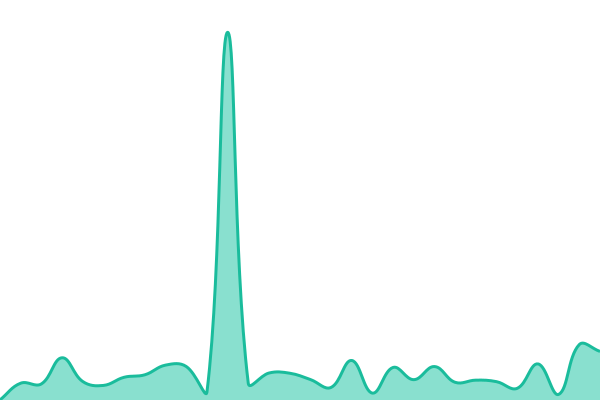
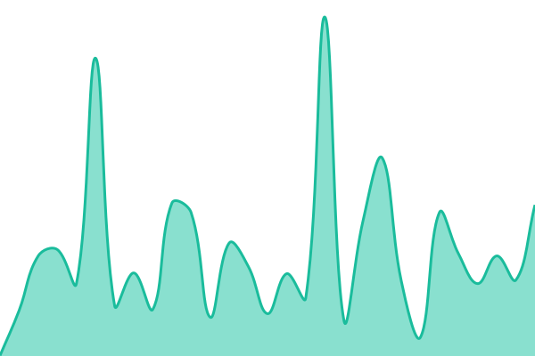
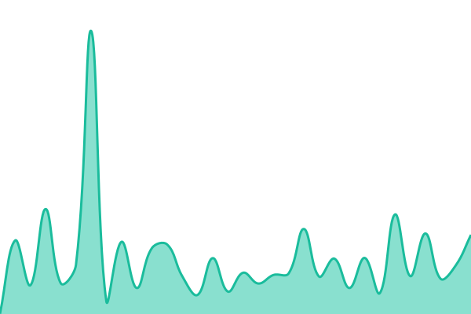
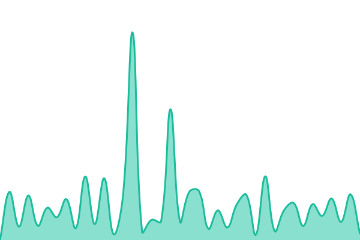

# [📈 Live Status](https://uptime.mjtwebsites.com): <!--live status--> **🟥 Complete outage**

This repository contains the open-source uptime monitor and status page for [MJTSoftware](https://uptime.mjtwebsites.com), powered by [Upptime](https://github.com/upptime/upptime).

With [Upptime](https://upptime.js.org), you can get your own unlimited and free uptime monitor and status page, powered entirely by a GitHub repository. We use [Issues](https://github.com/MJTSoftware/MJT-Uptime/issues) as incident reports, [Actions](https://github.com/MJTSoftware/MJT-Uptime/actions) as uptime monitors, and [Pages](https://uptime.mjtwebsites.com) for the status page.

<!--start: status pages-->
<!-- This summary is generated by Upptime (https://github.com/upptime/upptime) -->
<!-- Do not edit this manually, your changes will be overwritten -->
<!-- prettier-ignore -->
| URL | Status | History | Response Time | Uptime |
| --- | ------ | ------- | ------------- | ------ |
|  [MJT Websites](https://mjtwebsites.com/) | 🟥 Down | [mjt-websites.yml](https://github.com/MJTSoftware/MJT-Uptime/commits/HEAD/history/mjt-websites.yml) | 

 244ms
     
 | 

<a href="https://uptime.mjtwebsites.com/history/mjt-websites">85.88%</a>
    

|  [Appendix Cancer Connection](https://appendix-cancer.org/) | 🟥 Down | [appendix-cancer-connection.yml](https://github.com/MJTSoftware/MJT-Uptime/commits/HEAD/history/appendix-cancer-connection.yml) | 

 322ms
     
 | 

<a href="https://uptime.mjtwebsites.com/history/appendix-cancer-connection">85.90%</a>
    

|  [BCC](https://www.bcclegal.com/) | 🟥 Down | [bcc.yml](https://github.com/MJTSoftware/MJT-Uptime/commits/HEAD/history/bcc.yml) | 

 223ms
     
 | 

<a href="https://uptime.mjtwebsites.com/history/bcc">85.92%</a>
    

|  [CBC Surgery](https://www.cbcsurgery.com/) | 🟥 Down | [cbc-surgery.yml](https://github.com/MJTSoftware/MJT-Uptime/commits/HEAD/history/cbc-surgery.yml) | 

 278ms
     
 | 

<a href="https://uptime.mjtwebsites.com/history/cbc-surgery">85.94%</a>
    

|  [Cornerstone Community Church](https://www.cccofkouts.com/) | 🟥 Down | [cornerstone-community-church.yml](https://github.com/MJTSoftware/MJT-Uptime/commits/HEAD/history/cornerstone-community-church.yml) | 

 711ms
     
 | 

<a href="https://uptime.mjtwebsites.com/history/cornerstone-community-church">85.96%</a>
    

|  [Craig Anderson Plumbing](https://www.craigandersonplumbing.com/) | 🟥 Down | [craig-anderson-plumbing.yml](https://github.com/MJTSoftware/MJT-Uptime/commits/HEAD/history/craig-anderson-plumbing.yml) | 

 272ms
     
 | 

<a href="https://uptime.mjtwebsites.com/history/craig-anderson-plumbing">85.98%</a>
    

|  [DeMotte Decorative Stone](https://demottedecorativestone.com/) | 🟥 Down | [de-motte-decorative-stone.yml](https://github.com/MJTSoftware/MJT-Uptime/commits/HEAD/history/de-motte-decorative-stone.yml) | 

 287ms
     
 | 

<a href="https://uptime.mjtwebsites.com/history/de-motte-decorative-stone">86.00%</a>
    

|  [F&M Transfer](https://www.fmtransfer.net/) | 🟥 Down | [f-and-m-transfer.yml](https://github.com/MJTSoftware/MJT-Uptime/commits/HEAD/history/f-and-m-transfer.yml) | 

 261ms
     
 | 

<a href="https://uptime.mjtwebsites.com/history/f-and-m-transfer">86.02%</a>
    

|  [Friends of TheWC](https://friendsofthewc.org/) | 🟥 Down | [friends-of-the-wc.yml](https://github.com/MJTSoftware/MJT-Uptime/commits/HEAD/history/friends-of-the-wc.yml) | 

 344ms
     
 | 

<a href="https://uptime.mjtwebsites.com/history/friends-of-the-wc">86.04%</a>
    

|  [Jasper Newton Youth Activities](https://youthactivities.in/) | 🟥 Down | [jasper-newton-youth-activities.yml](https://github.com/MJTSoftware/MJT-Uptime/commits/HEAD/history/jasper-newton-youth-activities.yml) | 

 226ms
     
 | 

<a href="https://uptime.mjtwebsites.com/history/jasper-newton-youth-activities">86.06%</a>
    

|  [Jonkman Collision](https://jonkmancollision.com/) | 🟥 Down | [jonkman-collision.yml](https://github.com/MJTSoftware/MJT-Uptime/commits/HEAD/history/jonkman-collision.yml) | 

 220ms
     
 | 

<a href="https://uptime.mjtwebsites.com/history/jonkman-collision">86.08%</a>
    

|  [Pleasant Township Trustee](https://pleasanttownshiptrustee.org/) | 🟥 Down | [pleasant-township-trustee.yml](https://github.com/MJTSoftware/MJT-Uptime/commits/HEAD/history/pleasant-township-trustee.yml) | 

 282ms
     
 | 

<a href="https://uptime.mjtwebsites.com/history/pleasant-township-trustee">86.10%</a>
    

|  [Terborg Distributing](https://terborgdistributing.com/) | 🟥 Down | [terborg-distributing.yml](https://github.com/MJTSoftware/MJT-Uptime/commits/HEAD/history/terborg-distributing.yml) | 

 609ms
     
 | 

<a href="https://uptime.mjtwebsites.com/history/terborg-distributing">86.12%</a>
    

|  [The Women Center](https://www.thewc.org/) | 🟥 Down | [the-women-center.yml](https://github.com/MJTSoftware/MJT-Uptime/commits/HEAD/history/the-women-center.yml) | 

 317ms
     
 | 

<a href="https://uptime.mjtwebsites.com/history/the-women-center">86.15%</a>
    

|  [Von Excavating](https://vonexcavating.com/) | 🟥 Down | [von-excavating.yml](https://github.com/MJTSoftware/MJT-Uptime/commits/HEAD/history/von-excavating.yml) | 

 230ms
     
 | 

<a href="https://uptime.mjtwebsites.com/history/von-excavating">86.17%</a>
    

<!--end: status pages-->

[**Visit our status website →**](https://uptime.mjtwebsites.com)

## 📄 License

- Powered by: [Upptime](https://github.com/upptime/upptime)
- Code: [MIT](./LICENSE) © [Anand Chowdhary](https://anandchowdhary.com), supported by [Pabio](https://pabio.com)
- Data in the `./history` directory: [Open Database License](https://opendatacommons.org/licenses/odbl/1-0/)
